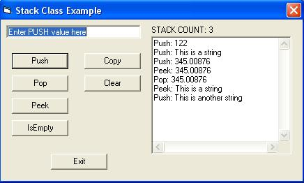



## CSTACK CLASS

### Description

!! UPDATED and IMPROVED !!

Now uses a dynamic array and increment control for more efficient stack resizing. The sky's the limit (or system memory, whichever comes first).

Implements a Stack class ("last on, first off" principle) that accepts different data types.

GUI demonstrates how to use this class.

Please rate this code!
 
### More Info
 

             |
---                |---
**Submitted On**   |2005-10-03 11:10:24
**By**             |[Jon Brown](https://github.com/Planet-Source-Code/PSCIndex/blob/master/ByAuthor/jon-brown.md)
**Level**          |Intermediate
**User Rating**    |5.0 (20 globes from 4 users)
**Compatibility**  |VB 6\.0
**Category**       |[Data Structures](https://github.com/Planet-Source-Code/PSCIndex/blob/master/ByCategory/data-structures__1-33.md)
**World**          |[Visual Basic](https://github.com/Planet-Source-Code/PSCIndex/blob/master/ByWorld/visual-basic.md)
**Archive File**   |[CSTACK\_CLA1937171032005\.zip](https://github.com/Planet-Source-Code/jon-brown-cstack-class__1-62725/archive/master.zip)

